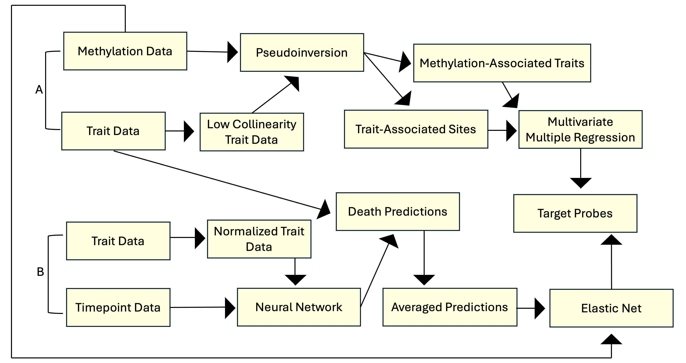

# pellegrini_temp

This repo is intended to track the ongoing development of the project. It is in-progress and is subject to change.

Presently, the model works by utilizing 2 models which eventually intersect. The first combines a survival neural network (2 hidden layers w/ timepoint as a parameter) with elastic net regression, and the second combines pseudoinversion with multiple multivariate regression. These processes are used, in conjunction with other filtering methods, to identify methylation probes and by extension genes significant in aging. These outputs are then overlapped, identifying a small set of highly significant probes.

The raw data files that the analysis uses are not available here.
