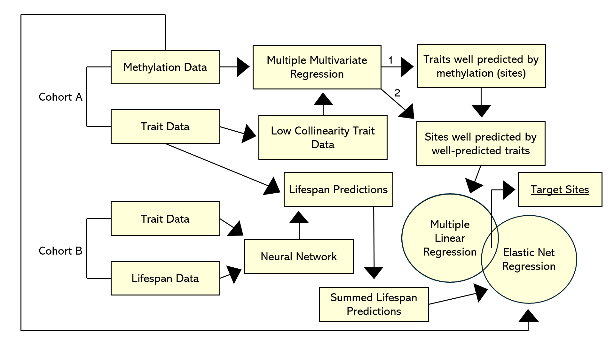
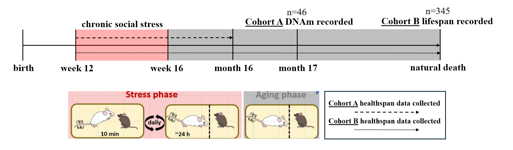

# Epigenetic Biomarkers of Mortality Risk in Mice Under Chronic Social Stress 

The analysis works by utilizing 2 models which eventually intersect. The first combines a survival neural network (2 layer MLP w/ timepoint as a parameter) with elastic net regression, intended to mimic the construction of an epigenetic clock. The second combines pseudoinversion with multiple linear regression, based on "The methylome of buccal epithelial cells is influenced by age, sex, and physiological properties". These processes are used, in conjunction with other filtering methods (standardization, normalization, and collinearity filtering based on Spearman correlation), to identify methylation probes, genes, and transcription factors which underlie aging in individuals exposed to chronic social stress. Each model has its own respective jupyter file, with "model intersection analysis" intersecting some of the results from the two analyses.

The raw data files that the analysis uses are not available here. The cohorts utilized by the models are depicted below.

 

All of the figures used in the manuscript are derived from the code and may be accessed there, with the exception of the formulas which were made in powerpoint
